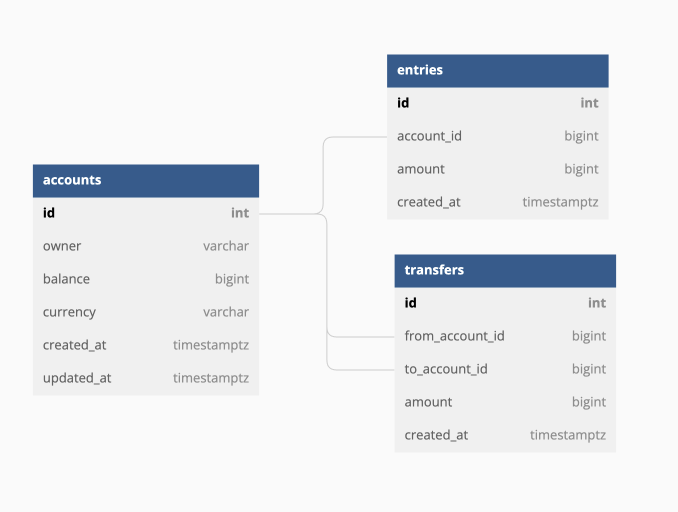

# Simple Bank

<details>
<summary>DB Schema</summary>
<div markdown=1>

## Schema



## Script

```sql
Table accounts as A {
  id int [pk, increment]
  owner varchar [not null]
  balance bigint [not null]
  currency varchar [not null]
  created_at bigint [not null]
  updated_at bigint [not null]
  timezone varchar

  Indexes {
    owner
  }
}

Table entries as E {
  id int [pk, increment]
  account_id bigint [ref: > A.id]
  amount bigint [not null, note: 'can be nagative']
  created_at bigint [not null]

  Indexes {
    account_id
  }
}

Table transfers {
  id int [pk, increment]
  from_account_id bigint [ref: > A.id]
  to_account_id bigint [ref: > A.id]
  amount bigint [not null, note: 'must be positive']
  created_at bigint [not null]

  Indexes {
    from_account_id
    to_account_id
    (from_account_id, to_account_id)
  }
}

```

```sql
CREATE DATABASE Simple_bank;

use Simple_bank;

CREATE TABLE `accounts` (
  `id` int PRIMARY KEY AUTO_INCREMENT,
  `owner` varchar(255) NOT NULL,
  `balance` bigint NOT NULL,
  `currency` varchar(255) NOT NULL,
  `created_at` bigint NOT NULL,
  `updated_at` bigint NOT NULL,
  `timezone` varchar(255)
);

CREATE TABLE `entries` (
  `id` int PRIMARY KEY AUTO_INCREMENT,
  `account_id` bigint,
  `amount` bigint NOT NULL COMMENT 'can be nagative',
  `created_at` bigint NOT NULL
);

CREATE TABLE `transfers` (
  `id` int PRIMARY KEY AUTO_INCREMENT,
  `from_account_id` bigint,
  `to_account_id` bigint,
  `amount` bigint NOT NULL COMMENT 'must be positive',
  `created_at` bigint NOT NULL
);

CREATE INDEX `accounts_index_0` ON `accounts` (`owner`);

CREATE INDEX `entries_index_1` ON `entries` (`account_id`);

CREATE INDEX `transfers_index_2` ON `transfers` (`from_account_id`);

CREATE INDEX `transfers_index_3` ON `transfers` (`to_account_id`);

CREATE INDEX `transfers_index_4` ON `transfers` (`from_account_id`, `to_account_id`);

ALTER TABLE `entries` ADD FOREIGN KEY (`account_id`) REFERENCES `accounts` (`id`);

ALTER TABLE `transfers` ADD FOREIGN KEY (`from_account_id`) REFERENCES `accounts` (`id`);

ALTER TABLE `transfers` ADD FOREIGN KEY (`to_account_id`) REFERENCES `accounts` (`id`);

```

</details>
